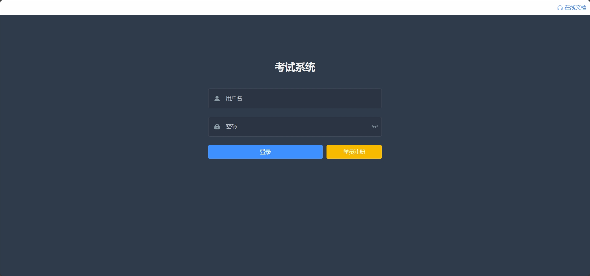
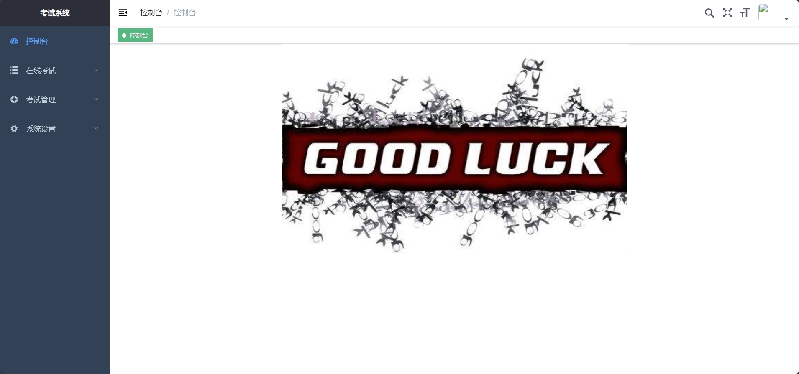
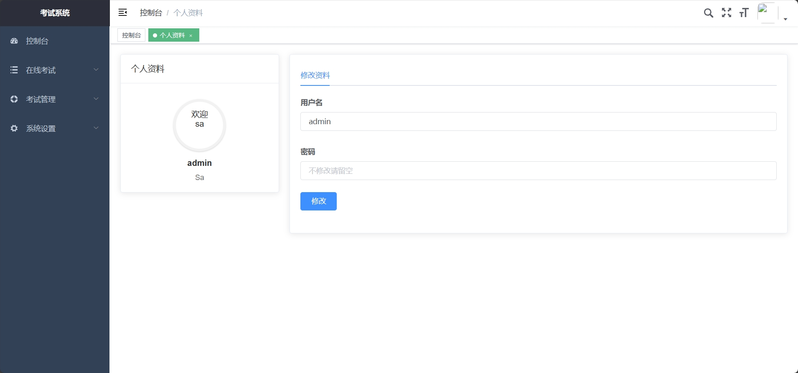
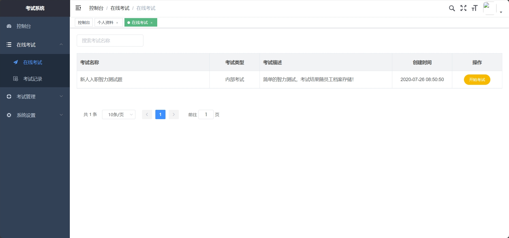
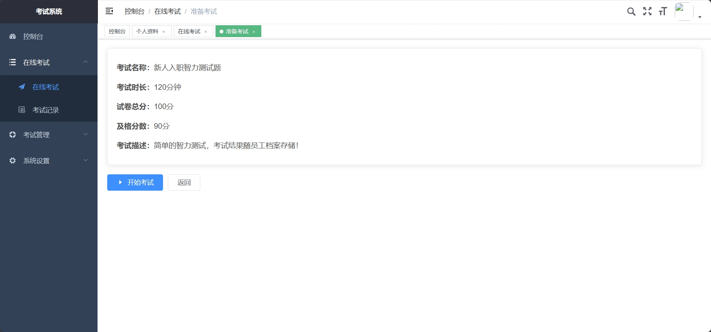
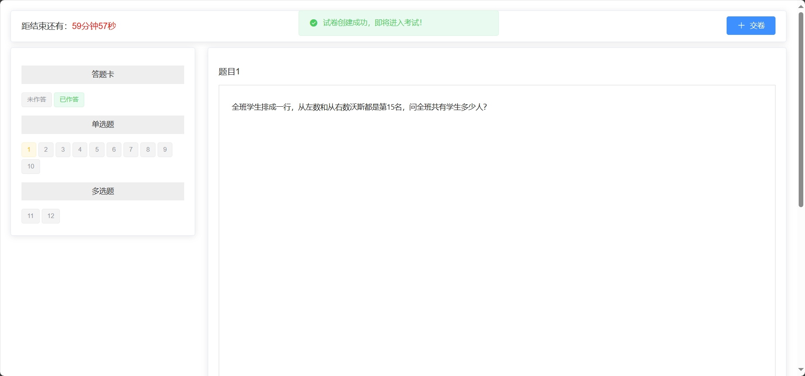
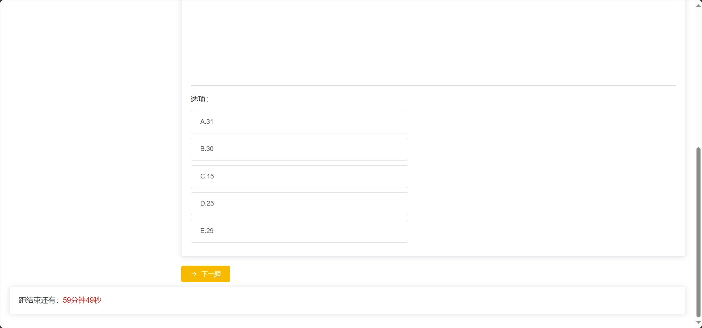

<h1 align="center">基于SSM的在线学习考试系统</h1>

<h4> 完整代码获取地址：从戎源码网（https://armycodes.com/） </h4>
<h4> 作者微信：19941326836 QQ：605739993 QQ群：655392706 </h4>
<h4> 承接计算机毕设、Java毕业设计、Python毕业设计、深度学习、机器学习 </h4>
<h4> 选题+开题报告+任务书+程序定制+安装调试+论文+答辩ppt 一条龙服务 </h4>
<h4> 毕业设计所有选题地址：(https://github.com/Descartes007/allProject) </h4>

## 一、项目介绍

基于SSM的在线学习考试系统：前端 ElementUI、Vue、Axios，后端 SpringBoot、Mybatis、Redis，系统角色分为：管理员、老师和学生，管理员在后台发布考试、对考试内容进行管理、对用户角色新增、日志管理等；管理员对系统进行管理，如用户、菜单、角色等；老师对试卷记录进行查看、管理等；学生对发布的试卷进行考试、查看考试情况。主要功能如下：

### 1、管理员：

- 基本操作：登录、修改密码、获取个人信息、修改个人信息、获取角色列表、获取系统日志列表、筛选系统日志信息
- 在线考试：获取考试列表、筛选考试信息、开始考试、获取考试记录、筛选考试记录
- 题库管理：获取题库列表、筛选题库信息、添加新题库、查看题库详情
- 试题管理：获取试卷列表、筛选试卷信息、添加新试卷、添加回答、新增答案解析、查看答案
- 规则管理：获取规则列表、筛选规则信息、添加新规则、查看规则详情
- 考试管理：获取考试列表、增加考试、筛选考试信息、查看考试详情
- 用户管理：添加新用户、获取用户列表、修改用户信息、查看用户信息详情

### 2、老师：

- 基本操作：登录、修改密码、获取个人信息、修改个人信息、获取角色列表
- 在线考试：获取考试列表、筛选考试信息、开始考试、获取考试记录、筛选考试记录
- 题库管理：获取题库列表、筛选题库信息、添加新题库、查看题库详情
- 试题管理：获取试卷列表、筛选试卷信息、添加新试卷、添加回答、新增答案解析、查看答案
- 规则管理：获取规则列表、筛选规则信息、添加新规则、查看规则详情
- 考试管理：获取考试列表、增加考试、筛选考试信息、查看考试详情

### 3、学员：

- 基本操作：登录、修改密码、获取个人信息、修改个人信息、注册
- 在线考试：获取考试列表、筛选考试信息、开始考试、获取考试记录、筛选考试记录

## 二、环境

- <b>IntelliJ IDEA 2020.3</b>

- <b>Mysql 5.7.26</b>

- <b>NodeJs 14.17.3</b>

- <b>Maven 3.6.3</b>

- <b>Redis 3.2.100及以上</b>

- <b>JDK 1.8</b>

## 三、运行截图

